# AWS Nginx Load Balancer with Two Apache Servers
**Public + Private Subnet Architecture | Round-Robin Load Balancing**

---
<p align="center">
  
</p>

<p align="center">
  
  
</p>

<p align="center">
  
  
</p>

---

## Table of Contents

- [Project Overview](#project-overview)
- [Objectives](#objectives)
- [Architecture Overview](#-architecture-overview)
  - [Traffic Flow](#traffic-flow)
- [AWS Setup Images](#aws-setup-images)
- [AWS Resources Used](#-aws-resources-used)
- [Security Group Design Detailed](#-security-group-design-detailed)
- [NAT Gateway Role in Security](#-nat-gateway-role-in-security)
- [Temporary Bastion Access Clarification](#temporary-bastion-access-clarification)
- [Final Security Summary](#final-security-summary)
- [Access Strategy Bastion Style](#-access-strategy-bastion-style)
- [Apache Server Configuration](#%EF%B8%8F-apache-server-configuration)
- [Nginx Load Balancer Configuration](#%EF%B8%8F-nginx-load-balancer-configuration)
- [Validation](#validation)

---

## Project Overview

This project demonstrates a **production-style AWS architecture** using a custom VPC where:

- **Nginx** acts as a **Reverse Proxy + Load Balancer** in port `80`
- **Two Apache web servers** run in **private subnets** in port `8080`
- Traffic flows securely from **Internet → Nginx → Apache servers**
- **Round-Robin load balancing** distributes requests evenly
- Backend servers are **not publicly accessible**

This setup is intentionally designed for **hands-on practice**, **cloud networking understanding**, and **DevOps fundamentals**.

---

## Objectives

- Understand **public vs private subnet architecture**
- Implement **Nginx reverse proxy & load balancing**
- Secure backend servers using **Security Group → Security Group rules**
- Practice **Linux server administration**
- Gain experience with **real AWS networking components**

---

## 🏗 Architecture Overview

📂 **Architecture Diagram:**  
<p align="center">
  
</p>


### Traffic Flow

```
Internet
   ↓
Elastic IP
   ↓
Nginx Load Balancer (Public Subnet)
   ↓
Private IP Communication
   ↓
Apache App Server 1 (Private Subnet)
   ↓
Apache App Server 2 (Private Subnet)
```

---

## 📌AWS Setup Images
<details>
<summary>AWS Infrastructure Setup Guide</summary><br>

This guide demonstrates a step-by-step setup of a basic AWS infrastructure including VPC, Subnets, Internet Gateway, Route Tables, Security Groups, EC2 Instances, Nginx Load Balancer, and backend Apache servers.  

All images and explanations are provided for clarity.

---

## Step 1: VPC & Subnet Creation
> The Virtual Private Cloud (VPC) is the foundation of your network. Subnets divide your VPC into smaller segments for better management, isolation, and security.

<details>
  <summary>Click to view details for Step 1</summary>

### Create VPC
- Navigate to **VPC → Create VPC** in the AWS console.
- Choose a **CIDR block** (e.g., `10.0.0.0/16`) for your network.
- Name the VPC appropriately (e.g., `MyVPC`).

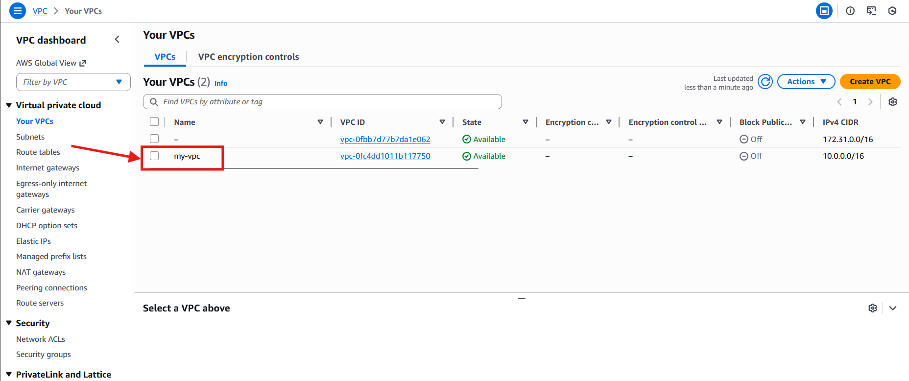

### Create Subnet
- Create **public and private subnets** within your VPC.
- Assign different IP ranges for each subnet.

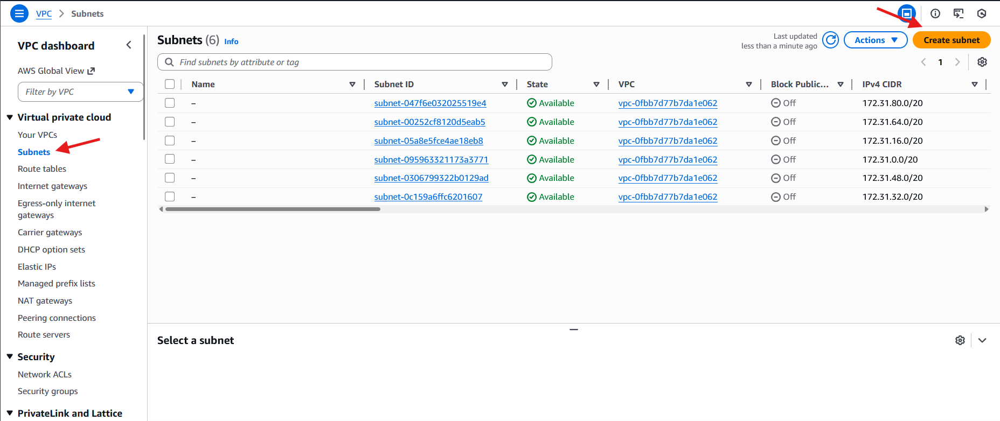

### Verify Subnets
- Ensure all subnets are correctly listed under your VPC.


</details>

---

## Step 2: Internet Gateway Setup
> The Internet Gateway (IGW) allows resources in your VPC to access the Internet. Without an IGW, public subnets cannot communicate externally.

<details>
  <summary>Click to view details for Step 2</summary>

### Create IGW
- Navigate to **VPC → Internet Gateways → Create Internet Gateway**.
- Provide a descriptive name (e.g., `MyIGW`).

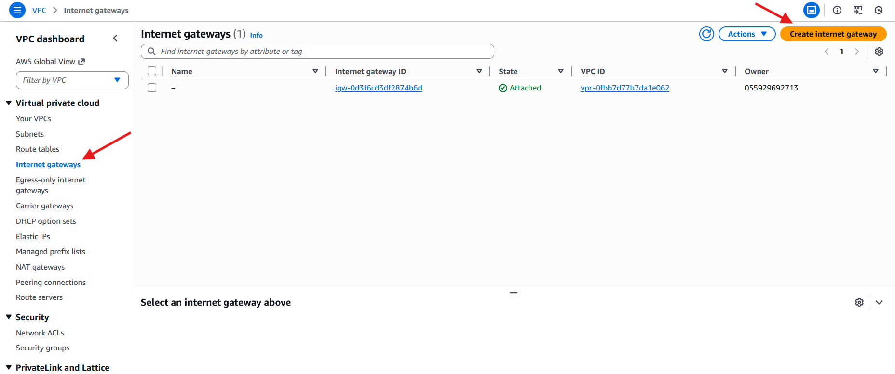

### Attach IGW
- Attach the IGW to your VPC to enable Internet connectivity for public subnets.

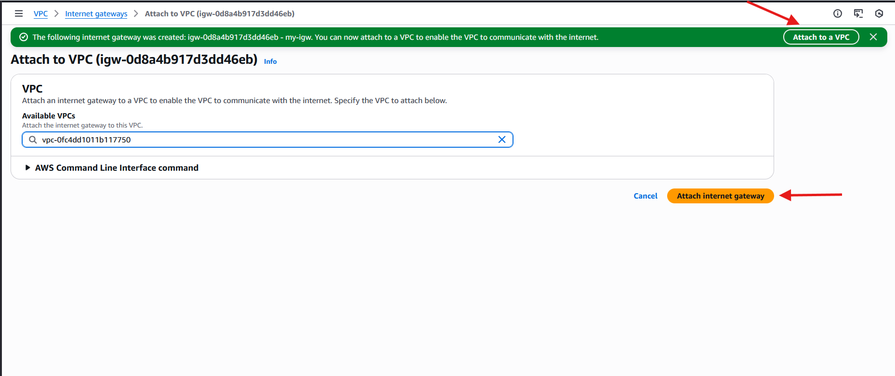

</details>

---

## Step 3: Route Tables (Public vs Private)
> Route tables control the flow of traffic. Public subnets are routed via the IGW for Internet access, while private subnets route traffic through a NAT Gateway.

<details>
  <summary>Click to view details for Step 3</summary>

### Public Route Table
- Routes traffic from public subnets to the Internet via IGW.

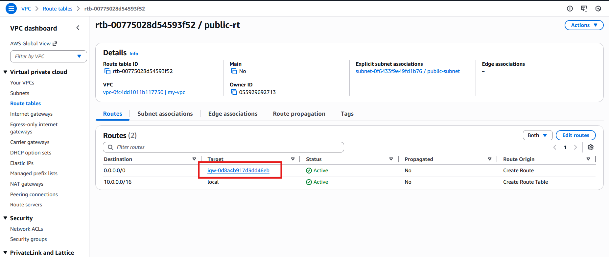

### Private Route Table
- Routes traffic from private subnets to the Internet via NAT Gateway.

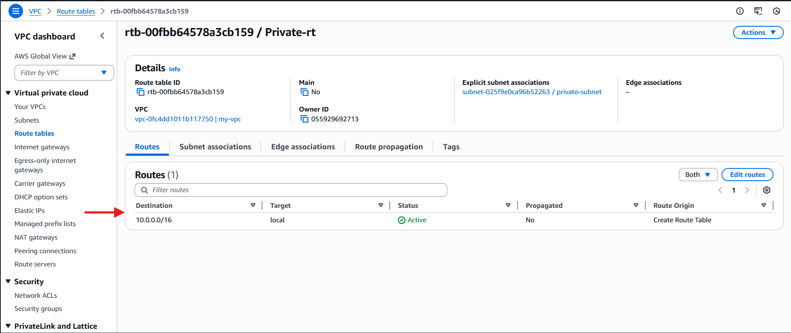

</details>

---

## Step 4: Security Group Design
> Security Groups act as virtual firewalls, controlling inbound and outbound traffic for your instances. Proper configuration ensures only legitimate traffic reaches your resources.

<details>
  <summary>Click to view details for Step 4</summary>

### Nginx Security Group
- Allows inbound HTTP (port 80) and HTTPS (port 443) and ssh (port 22) traffic from the Internet.

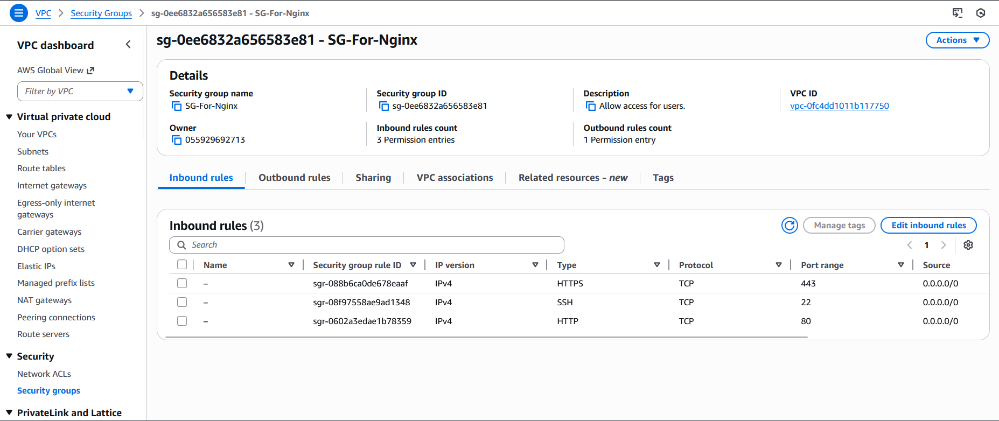

### App Server Security Group
- Allows inbound traffic from Nginx Load Balancer on application ports.

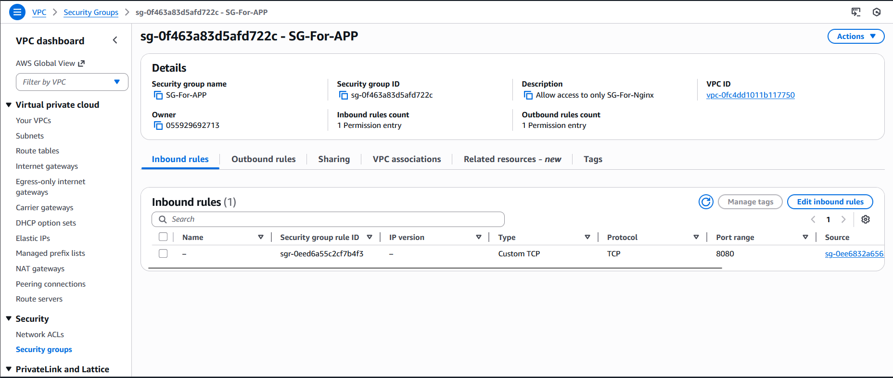

</details>

---

## Step 5: EC2 Instances
> Deploy EC2 instances to host your application servers. Use appropriate instance types based on workload requirements and subnet placement.

<details>
  <summary>Click to view details for Step 5</summary><br>

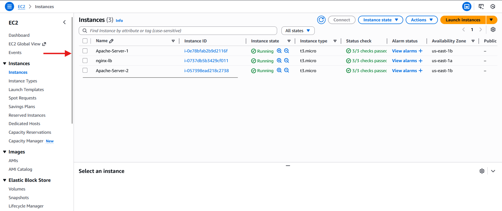

</details>

---

## Step 6: Nginx Load Balancer
> Use Nginx as a load balancer to distribute incoming traffic across multiple backend servers. Assigning an Elastic IP ensures a static public address.

<details>
  <summary>Click to view details for Step 6</summary><br>

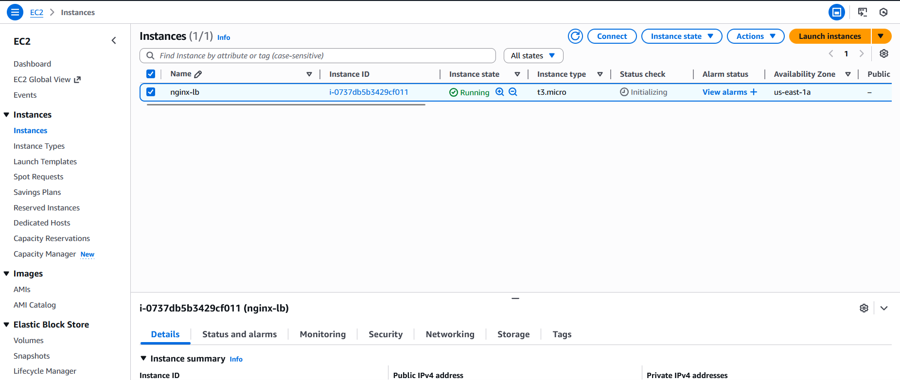

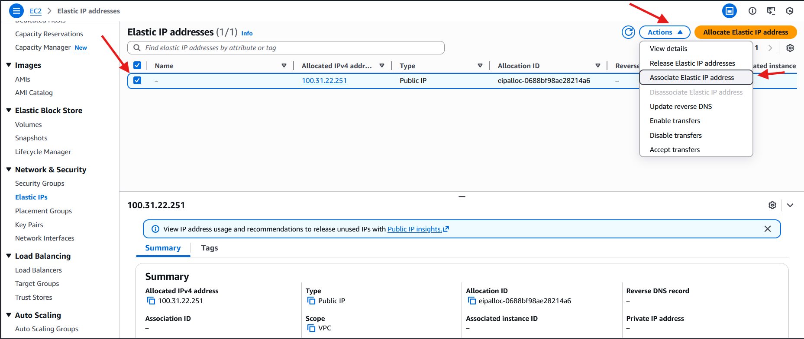

</details>

---

## Step 7: Apache Backend Servers
> These servers host your applications. The Nginx Load Balancer will distribute traffic evenly across them to ensure high availability.

<details>
  <summary>Click to view details for Step 7</summary>

### App Server 1
- Hosts the Application Server-1.
- Apache2 is running successfully, its service status is checked, and it confirms that Apache is listening on port 8080.

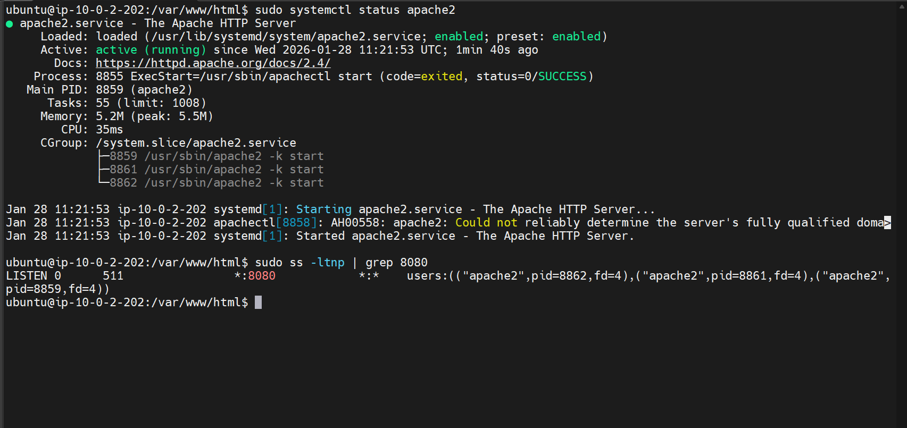

### App Server 2
- Hosts the application Server-2.
- Apache2 is running successfully, its service status is checked, and it confirms that Apache is listening on port 8080.

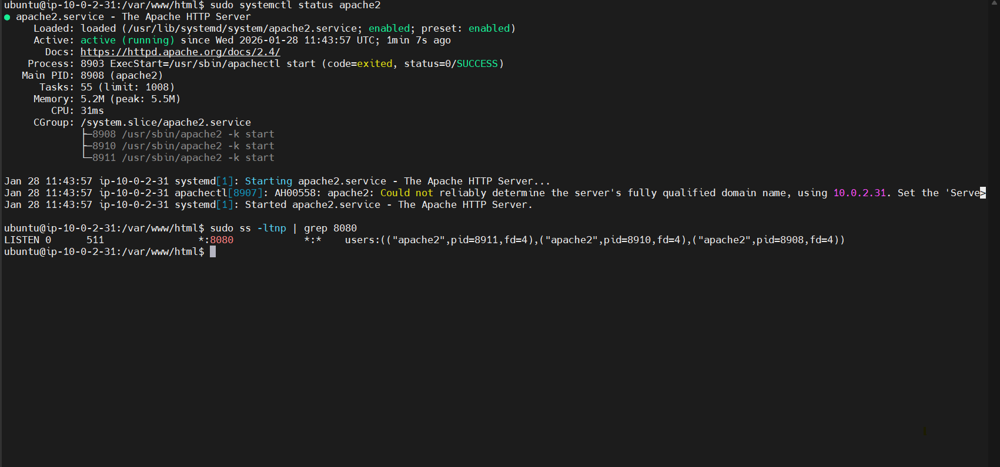

</details>

---

## Step 8: Load Balancing Verification
> After configuring Nginx and backend servers, test that traffic is being correctly distributed and served by both backend servers.

<details>
  <summary>Click to view details for Step 8</summary>

### Server Response
- Displays content served by App Server 1 initially, using `Round-Robin`.

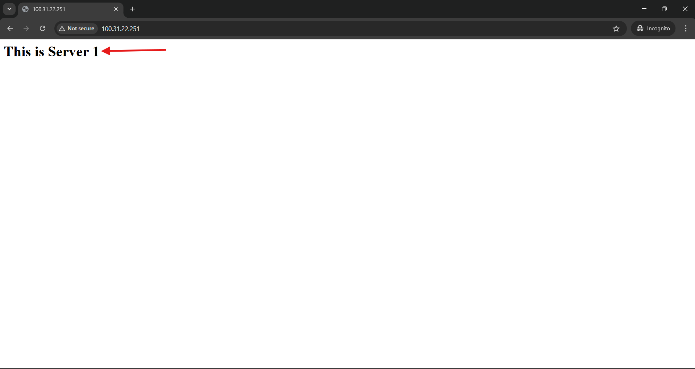

### Server Response
- Displays content served by App Server 2 after a reload, using `Round-Robin`.


</details>
</details>


## 🧱 AWS Resources Used

### Networking

- **VPC:** `10.0.0.0/16`
- **Public Subnet:** Nginx Load Balancer
- **Private Subnet:** Apache App Servers
- **Internet Gateway:** Internet access for Nginx
- **NAT Gateway:** Outbound internet access for private servers
- **Route Tables:** Separate public and private routing

### EC2 Instances

| Instance Name | Role | Subnet |
|--------------|------|--------|
| nginx-lb (80) | Nginx Reverse Proxy & Load Balancer | Public |
| App-Server-1(8080) | Apache Web Server | Private |
| App-Server-2(8080) | Apache Web Server | Private |

- Instance Type: **t3.micro**
- OS: **Ubuntu**
- Elastic IP attached **only to Nginx**

📌 **Why Elastic IP?**  
Ensures the main entry point IP never changes, which is critical in real-world environments.

---

## 🔐 Security Group Design (Detailed)

Security Groups are used as the **primary security control at the instance level**.  
This architecture follows the **principle of least privilege** while allowing temporary administrative access for setup and maintenance.

---

### 🔹 SG-For-Nginx (Public / Bastion + Load Balancer)

This security group is attached to the **Nginx Load Balancer** instance, which also acts as a **temporary bastion host**.

#### Inbound Rules

- **HTTP (80)** → `0.0.0.0/0`
- **SSH (22)** → Trusted IP (or temporarily `0.0.0.0/0`)

#### Outbound Rules

- **All traffic allowed**

📌 **Purpose:**

- Public-facing entry point  
- Reverse proxy + load balancer  
- Temporary bastion host  

---

### 🔹 SG-For-APP (Private Apache Servers)

#### Inbound Rules

- **TCP 8080** → **SG-For-Nginx**
- **SSH (22)** → **SG-For-Nginx** *(Temporary)*

#### Outbound Rules

- **All traffic allowed**

📌 **Purpose:**

- No direct internet access  
- Accepts traffic only from Nginx  

---

## 🌐 NAT Gateway Role in Security

- Private servers do **not** have public IPs  
- NAT Gateway allows:
  - `apt update`
  - Package installation
  - Outbound-only access  
- No inbound traffic allowed

📌 **Security Benefit:**  
Private servers stay isolated from the internet.

---

## Temporary Bastion Access Clarification

During setup:

- SSH from Nginx to App servers was temporarily enabled  
- Allowed configuration, installation & updates  

Post-setup:

- Remove SSH (22) from SG-For-APP  
- Keep only **8080** open from Nginx  

---

## Final Security Summary

- Public traffic → **Nginx only**  
- Backend servers → **Private & protected**  
- NAT Gateway → **Outbound-only**  
- SG-to-SG rules → **Zero trust**  
- Bastion access → **Temporary**  

---

## 🧭 Access Strategy (Bastion-Style)

- `nginx-lb` acts as a **bastion host**  
- Apache servers → **private IP only**  
- SSH flows **through Nginx**  

---


## ⚙️ Apache Server Configuration  
*(Performed on App-Server-1 and App-Server-2)*

### 1️⃣ Update Package Lists & Install Apache

```bash
sudo apt update
sudo apt install apache2 -y
```

---

### 2️⃣ Change Apache Port from 80 to 8080

```bash
sudo sed -i 's/80/8080/g' /etc/apache2/ports.conf
sudo sed -i 's/:80/:8080/g' /etc/apache2/sites-enabled/000-default.conf
```
- `sudo`  
  - Runs the command with **root (administrator) privileges**, which is required to modify Apache configuration files under `/etc/apache2/`.

- `sed`  
  - A **stream editor** used to search, find, and replace text inside files.

- `-i`  
  - Means **in-place editing**.  
  - The file is modified directly without creating a separate output file.

- `'s/80/8080/g'`  
  - `s` → substitute command  
  - `80` → text to search for  
  - `8080` → replacement text  
  - `g` → global flag (replaces **all occurrences** in each line)

- `/etc/apache2/ports.conf`  
  - Apache configuration file that defines **which ports Apache listens on**.  
  - This command changes Apache’s listening port from **80 to 8080**.

---

- `'s/:80/:8080/g'`  
  - Searches specifically for `:80` to avoid replacing unrelated `80` values.  
  - Replaces it with `:8080` everywhere in the file.

- `/etc/apache2/sites-enabled/000-default.conf`  
  - Default Apache **virtual host configuration** file.  
  - This command updates the VirtualHost directive from:
    - `<VirtualHost *:80>`
    - to `<VirtualHost *:8080>`

---

- **Overall Effect**
  - Apache stops listening on port **80**.
  - Apache starts listening on port **8080**.
  - The default website is now served on:
    - `http://<server-ip>:8080`

- **Important Reminder**
  - After making these changes, Apache must be restarted:
    
---

### 3️⃣ Restart Apache

```bash
sudo systemctl restart apache2
```

---

### 4️⃣ Create Custom Index Page

**App-Server-1**

```bash
echo "<h1>App Server 1</h1>" | sudo tee /var/www/html/index.html
```

**App-Server-2**

```bash
echo "<h1>App Server 2</h1>" | sudo tee /var/www/html/index.html
```
`|` → passes the output to the next command  
- `sudo` → allows writing to a protected system directory  
- `tee /var/www/html/index.html` → writes the content to Apache’s default web page file  
- **Result** → visiting the server shows **App Server X** in the browser
---

## ⚖️ Nginx Load Balancer Configuration

### 1️⃣ Install Nginx

```bash
sudo apt update
sudo apt install nginx -y
```

---

### 2️⃣ Configure Nginx Reverse Proxy

📄 **File:** `/etc/nginx/sites-available/default`

```bash
upstream backend_servers {
    server 10.0.2.11:8080;
    server 10.0.2.12:8080;
}

server {
    listen 80;

    location / {
        proxy_pass http://backend_servers;
        proxy_set_header Host $host;
        proxy_set_header X-Real-IP $remote_addr;
        proxy_set_header X-Forwarded-For $proxy_add_x_forwarded_for;
    }
}
```

- `upstream backend_servers` → defines a backend server pool for load balancing  
- `server 10.0.2.11:8080;` → first backend application server  
- `server 10.0.2.12:8080;` → second backend application server  

- `server {}` → Nginx virtual server block  
- `listen 80;` → Nginx listens for client requests on port 80  

- `location /` → handles all incoming requests  
- `proxy_pass http://backend_servers;` → forwards requests to the backend servers  
- `proxy_set_header Host $host;` → forwards original host header  
- `proxy_set_header X-Real-IP $remote_addr;` → passes real client IP  
- `proxy_set_header X-Forwarded-For $proxy_add_x_forwarded_for;` → keeps client IP chain


- Replace the server ip with your own.

---

### 3️⃣ Test and Reload Nginx

```bash
sudo nginx -t
sudo systemctl reload nginx
```

---

## Validation

- Open browser  
- Visit Elastic IP of Nginx  
- Refresh multiple times  

Expected output:

```
App Server 1
App Server 2
```

✔ Round‑robin load balancing successful  


